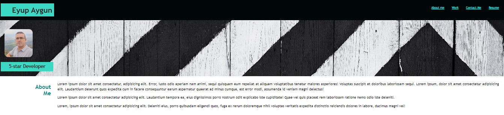
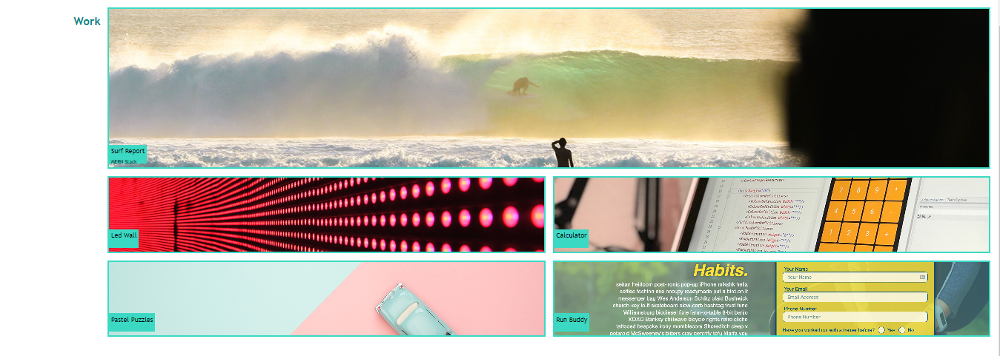

# myportfoliopage
My portfolio page

## Description

This portfolio website has been built to showcase my technical skills, web design skills and my projects.

## Technologies Used
HTML5
CSS3
JavaScript (ES6)
Git
GitHub
Bootstrap
Visual Studio Code

## Installation

N/A

## Usage

The navbar at the top provides links to the sections About Me, Work (Projects & Apps), Contact Me and Resume. If you click on the desired link, you are directed to relevant section. You can get detailed information and links to my projects and apps when you click on anywhere on the background picture of each 
section.

https://jobmoonday.github.io/myportfoliopage/

## Screenshots of the app

 

## Credits

N/A

## License

Please refer to the LICENCE in the repo.
